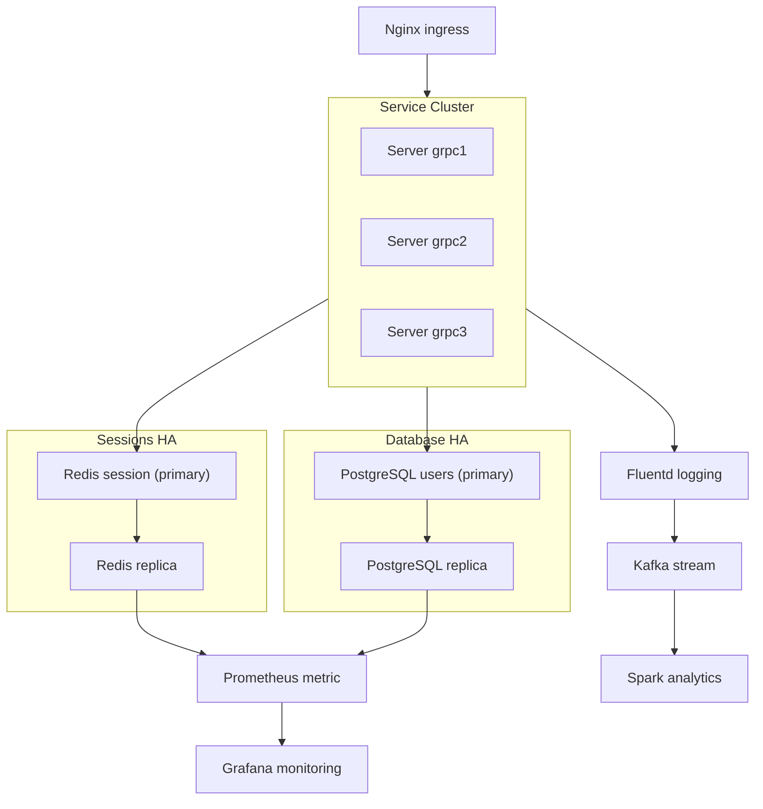

# Architecture Documentation

This document describes the architecture of the Advanced Web Service with On-Premises components, as defined in `diagram.py`.

## Overview
The system is a web service architecture featuring ingress, services, databases, monitoring, and analytics components, all running on-premises.

## Components

- **Ingress**: Nginx handles incoming requests.
- **Monitoring**: Prometheus collects metrics, visualized by Grafana.
- **Service Cluster**: Contains 3 gRPC servers (grpc1, grpc2, grpc3) for processing requests.
- **Sessions HA**: High-availability Redis setup with primary and replica for session storage.
- **Database HA**: High-availability PostgreSQL setup with primary and replica for user data.
- **Logging and Analytics**: Fluentd aggregates logs, streams to Kafka, and processes with Spark.

## Data Flow
- Requests enter via Nginx → Service Cluster (gRPC servers) → Sessions (Redis) and Database (PostgreSQL).
- Metrics from Redis and PostgreSQL are collected by Prometheus and monitored via Grafana.
- Logs from services flow to Fluentd → Kafka → Spark for analytics.

## Diagram
The architecture can be visualized using the following Mermaid diagram:

To generate the visual diagram, run `python diagram.py` which produces a PNG file.